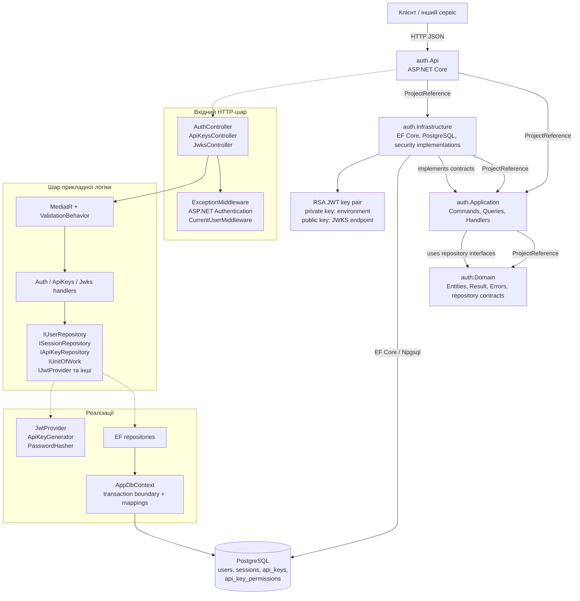
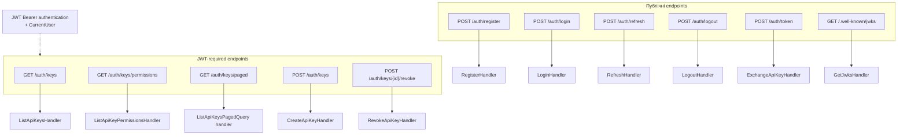
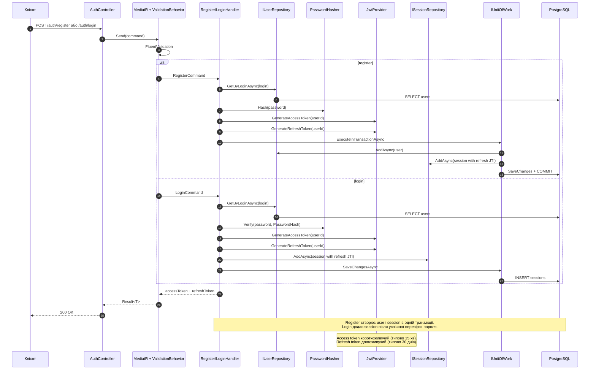
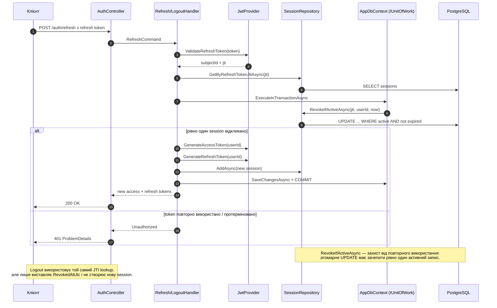
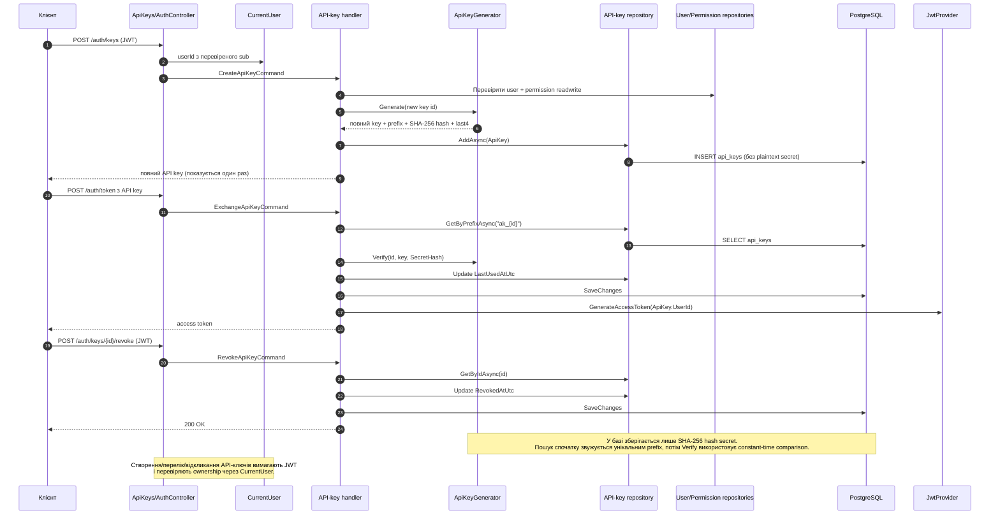
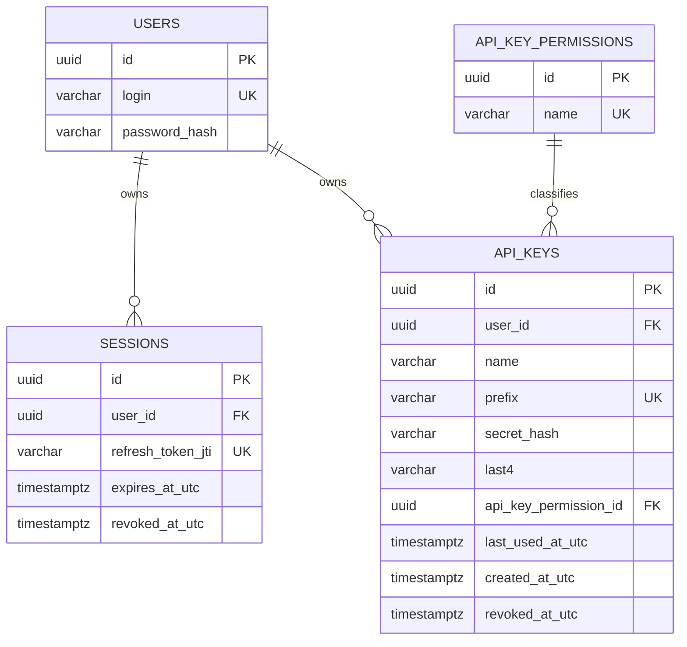
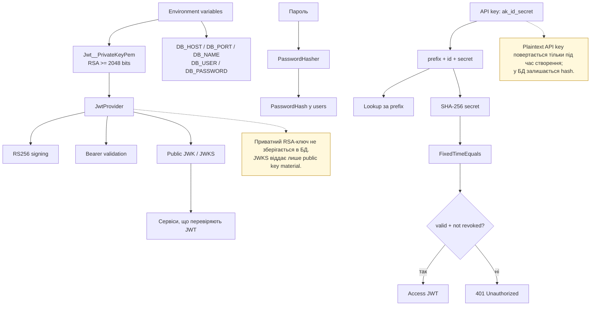

# Архітектура сервісу автентифікації

Документ показує структуру сервісу `auth`, основні залежності та життєві цикли
автентифікації. Діаграми можна переглядати у VS Code з Mermaid-розширенням або
у GitHub/іншому Markdown-рендері з підтримкою Mermaid.

## 1. Загальна структура та залежності шарів

> **Нотатка:** `Application` залежить лише від контрактів, а не від EF Core чи
> PostgreSQL. Реальні repository/security-реалізації підключаються в
> `Program.cs` через `AddInfrastructure()` і DI.

## 2. HTTP-конвеєр запиту

```mermaid
flowchart LR
    Request["HTTP request"] --> Exceptions["ExceptionMiddleware"]
    Exceptions --> Swagger["Swagger / Swagger UI<br/>(документація)"]
    Swagger --> AuthN["UseAuthentication<br/>JWT Bearer validation"]
    AuthN --> CurrentUser["CurrentUserMiddleware<br/>sub claim -> ICurrentUser"]
    CurrentUser --> AuthZ["UseAuthorization"]
    AuthZ --> Controller["Controller action"]
    Controller --> Send["ISender.Send(command/query)"]
    Send --> Validation["ValidationBehavior<br/>FluentValidation"]
    Validation -->|valid| Handler["MediatR handler"]
    Validation -->|invalid Result| Controller
    Handler --> Result["Result / Result<T>"]
    Result --> Base["BaseApiController.HandleResult"]
    Base --> Response["200 / ProblemDetails"]

    Note1["Валідація виконується до handler.<br/>Помилки домену не кидаються як винятки:<br/>вони перетворюються на HTTP ProblemDetails."]:::note
    Validation -.-> Note1

    Note2["CurrentUserMiddleware запускається після JWT authentication,<br/>тому читає вже перевірений sub claim."]:::note
    CurrentUser -.-> Note2

    classDef note fill:#fff8dc,stroke:#b8860b,color:#333;
```

## 3. Публічні HTTP-поверхні

## 4. Реєстрація та login

## 5. Refresh rotation та logout

## 6. API-ключі: створення, обмін і відкликання

## 7. Модель даних і зв'язки

> **Нотатка:** видалення `User` каскадно видаляє його `Session` і `ApiKey`.
> Видалення permission заборонене (`Restrict`), тому permission не може
> залишити ключі без класифікації.

## 8. Безпекові особливості

## 9. Швидка навігація по коду

| Область | Основні файли |
|---|---|
| HTTP і middleware | `src/Api/Program.cs`, `src/Api/Controllers/`, `src/Api/Middleware/` |
| Команди, queries і handlers | `src/Application/Commands/`, `src/Application/Queries/`, `src/Application/Handlers/` |
| Валідація | `src/Application/Validators/`, `src/Application/Behaviors/ValidationBehavior.cs` |
| Контракти | `src/Application/Abstractions/`, `src/Domain/Repositories/` |
| Модель домену | `src/Domain/Entities/`, `src/Domain/Result.cs`, `src/Domain/Errors/` |
| Persistence | `src/Infrastructure/Persistence/AppDbContext.cs`, `src/Infrastructure/Persistence/Repositories/` |
| Security | `src/Infrastructure/Security/` |

